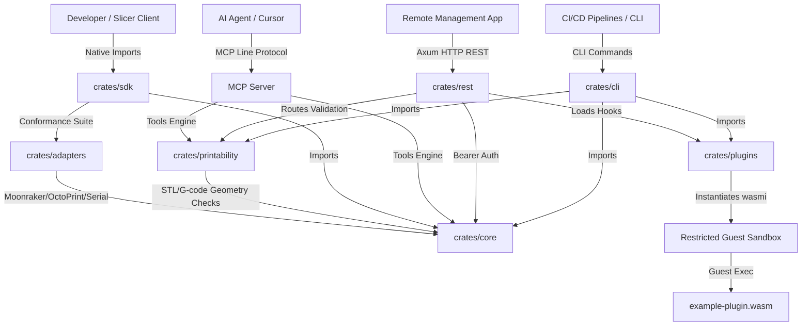
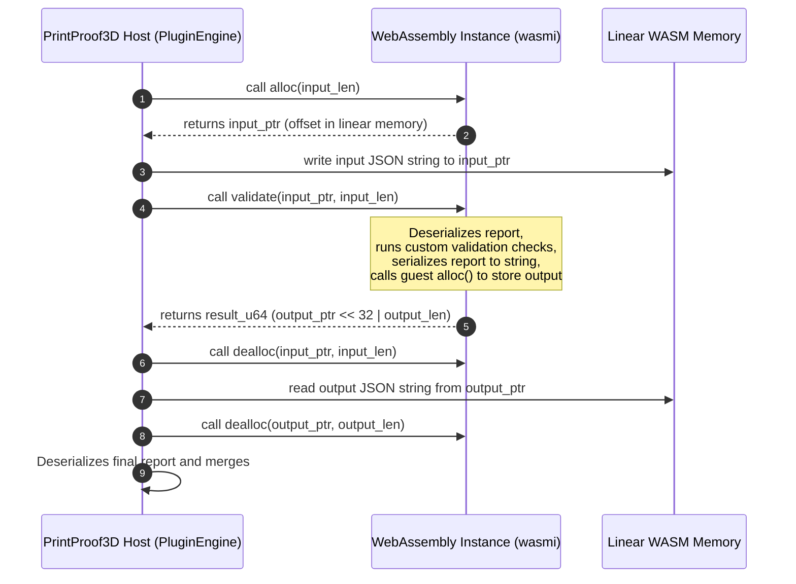
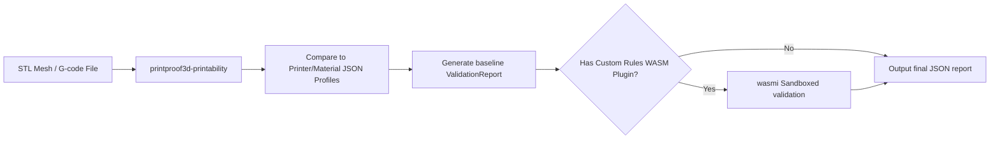

# PrintProof3D System Architecture & Drawings

This document describes the design principles, crate boundaries, data flow, and runtime mechanics within PrintProof3D.

---

## 1. System Topology & Integration Boundaries

PrintProof3D exposes multiple programmatic and network boundaries to support client integrations (AI agents, static analyzers, and remote management tools):

---

## 2. WebAssembly Memory Sandbox Flow

Custom validation rules are loaded as WASM byte slices and executed in a restricted memory sandbox utilizing the `wasmi` interpreter. Memory exchanges use raw pointer layouts (`alloc`, `dealloc`, and `validate` exports):

---

## 3. Conformance Test Suite Flowchart

The automated SDK conformance suite validates that third-party `PrinterAdapter` implementations preserve state invariants and respond correctly under normal and simulated failure paths:

---

## 4. Decoupled Data Flow Pipeline

Data validations flow through independent analysis and filtration layers:

