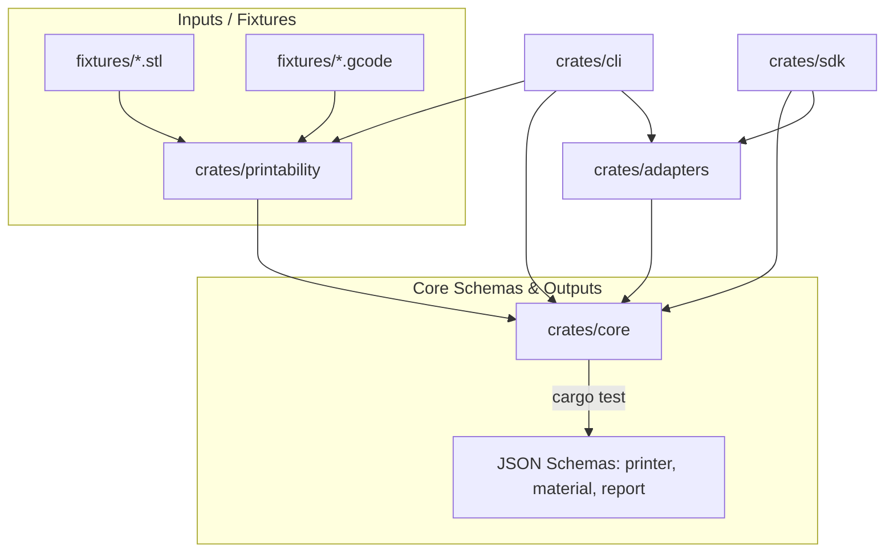

# PrintProof3D Architecture

This document describes the design principles, crate boundaries, data flow, and automation systems within PrintProof3D.

## Design Philosophy

1. **Type-Safe Data Models**: All printer profiles, material specifications, and validation results are represented as strict, type-safe Rust structures.
2. **Schema-Driven Handoff**: Profiles and reports are exported to standard JSON Schemas, allowing interoperability with external frontend clients, databases, and scripting languages.
3. **Decoupled Connectivity**: Firmware and host adapters are wrapped in uniform interfaces, separating serial/HTTP communication logic from print safety analysis.

---

## Crate Layout & Dependencies

The system is split into five logical modules within a Cargo workspace:



### 1. `printproof3d-core`
- **Responsibility**: Contains all core enums (`BedShape`, `ProtocolFamily`, `FirmwareFlavor`, `ValidationStatus`, `IssueSeverity`) and profile structs.
- **JSON Schema Target**: Serves as the source of truth for the project's data schema. Running `cargo test` regenerates the schema files in `/schemas`.

### 2. `printproof3d-printability`
- **Responsibility**: Houses the geometry parser and boundary validation code.
- **Analysis Types**:
  - STL validation (verifies manifold boundaries, bounds limits, and overhang flags).
  - G-code static parsing (identifies temperature thresholds and build-envelope violations).

### 3. `printproof3d-adapters`
- **Responsibility**: Implements API clients and serial drivers for:
  - **Moonraker**: Websocket and HTTP interface for Klipper.
  - **OctoPrint**: REST client for standard API commands.
  - **Marlin Serial**: Direct serial interface using G-code commands.

### 4. `printproof3d-sdk`
- **Responsibility**: Exposes a clean, high-level developer SDK to initialize validation tasks and test adapter compliance.

### 5. `printproof3d` (CLI)
- **Responsibility**: Exposes command-line interactions and an MCP server.

---

## Schema Auto-Generation Pipeline

To prevent drift between the Rust struct definitions and the JSON Schemas, the generation pipeline is automated using the `schemars` crate:

```rust
#[cfg(test)]
mod tests {
    #[test]
    fn generate_schemas() {
        // Generates schemas and outputs them to the workspace root's /schemas directory.
    }
}
```

This test runs as part of the pre-push hook configuration, ensuring that any model updates are verified and compiled into schemas before changes are pushed to remote repositories.
