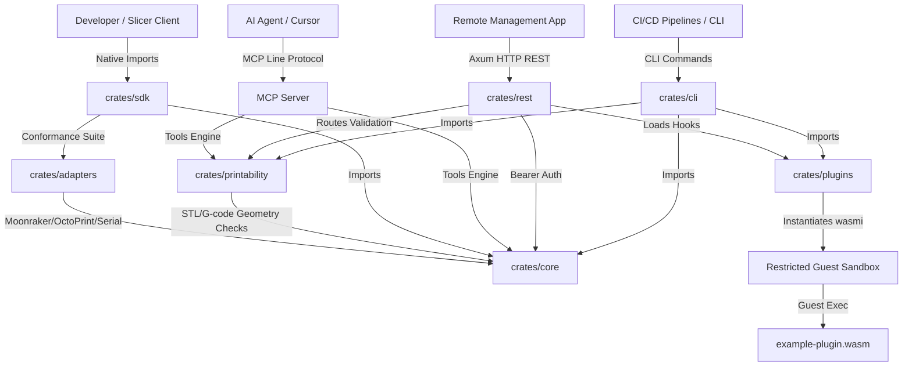
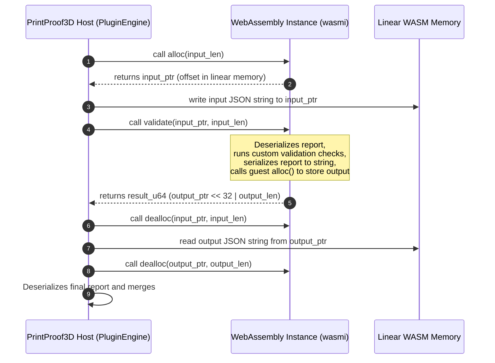
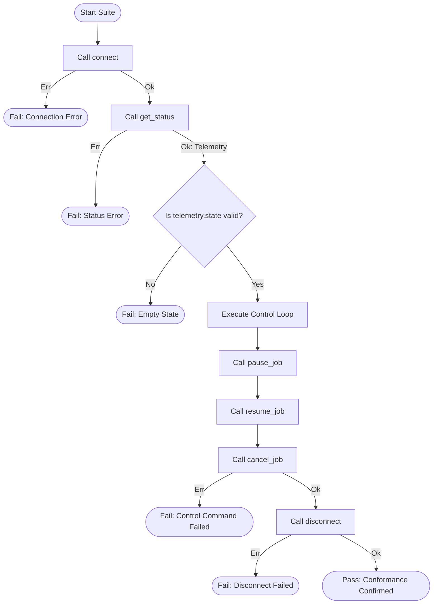
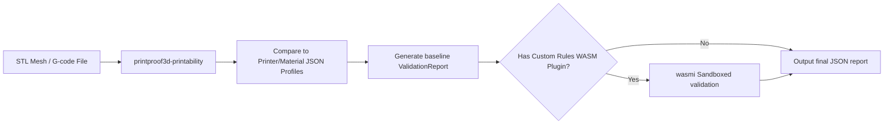

# PrintProof3D: System Architecture & Design Specification

This document details the software architecture, design principles, crate boundaries, data flow pipelines, and runtime memory mechanics within the PrintProof3D engine.

---

## 1. System Topology & Integration Boundaries

PrintProof3D is structured as a cargo workspace containing decoupled, specialized crates. This design maintains strict separation of concerns, ensures compilation boundaries are kept clean, and allows specific subsets of the project to be integrated into different environments (such as compiling plugins to WebAssembly without pulling in network server dependencies).

### 1.1 Architectural Topology Diagram
The diagram below illustrates how client interfaces (native developers, CLI pipelines, REST clients, and AI agents) route requests through the engine's modular layers:

### 1.2 Crate Responsibilities & Interfaces
* **`printproof3d-core`**: The absolute foundation of the project. It defines the shared, serializable domain models (`PrinterProfile`, `MaterialProfile`, `ValidationReport`). It compiles JSON schemas automatically to ensure other languages (e.g. JavaScript frontend clients) stay synchronized with the Rust core.
* **`printproof3d-printability`**: The mathematical validation engine. It contains parsers for ASCII STL and raw G-code, running spatial and thermal audits against the core profiles. It depends only on `printproof3d-core` to remain highly embeddable.
* **`printproof3d-plugins`**: The WASM runtime supervisor. It instantiates the `wasmi` interpreter, loads compiled guest `.wasm` bytecode arrays, and manages memory writing and reading over linear memory buffers.
* **`printproof3d-adapters`**: The physical connection protocol layer. It declares the asynchronous `PrinterAdapter` trait and houses connection configurations for serial channels, Moonraker/Klipper, and OctoPrint endpoints.
* **`printproof3d-sdk`**: The development and test integration SDK. It provides mock servers (OctoPrint, Duet/RRF, Bambu MQTT/FTP) and exposes a conformance verification test suite to ensure connection clients operate reliably.
* **`printproof3d-cli`**: The shell interface. It handles command line option parsing, compiles output validation files, and runs the MCP JSON-RPC 2.0 server.
* **`printproof3d-rest`**: The network service layer. It wraps validation operations in an Axum web daemon, enforcing Bearer token authentication middleware on secure endpoints.

---

## 2. WebAssembly Memory Sandbox Flow

Custom validation rules run inside a restricted WebAssembly linear memory sandbox using `wasmi`. Guest plugins have zero direct access to the filesystem, network sockets, or operating system calls, preventing malicious code execution.

### 2.1 The Pointer-Length Exchange Protocol
Because WebAssembly linear memory is isolated from the host application's memory space, data exchange must be performed by copying raw bytes over shared linear memory. PrintProof3D uses a pointer-length exchange protocol:

1. **Allocation**: The host queries the length of the serialized JSON input report, calling the guest's exported `alloc` function to reserve space in linear memory. The guest returns the starting memory offset (pointer).
2. **Writing**: The host writes the JSON string bytes directly into the guest's linear memory at the designated pointer offset.
3. **Execution**: The host triggers the guest's exported `validate` function, passing the pointer and length. The guest deserializes the JSON string into its local memory space, executes the custom rules, serializes the updated report back to a JSON string, and allocates an output buffer.
4. **Result Packaging**: The guest packs the output pointer and output length into a single 64-bit unsigned integer to return it over the WebAssembly boundary:
   $$\text{result\_u64} = (\text{output\_ptr} \ll 32) \mid \text{output\_len}$$
5. **Reading & Cleanup**: The host unpacks the integer, reads the result JSON string from the guest's memory, calls the guest's `dealloc` function to clean up both the input and output buffers, and deserializes the final report.

---

## 3. Conformance Test Suite Flow

To ensure third-party communication adapters interact safely with physical hardware, the SDK provides a conformance validation suite. The harness tests connection handling, telemetry polling, status changes, and emergency abort controls:

The test runner asserts that:
* Sockets and serial streams are initialized correctly via `connect`.
* Connection issues, authentication failures, and transmission errors are captured and returned using the standardized `AdapterError` enum.
* `get_status` telemetry states conform to known machine categories (`IDLE`, `PRINTING`, `PAUSED`, `ERROR`).
* The abort sequence (`pause_job` $\rightarrow$ `resume_job` $\rightarrow$ `cancel_job`) maintains correct state transitions.
* `disconnect` successfully closes sockets, loops, and threads.

---

## 4. Decoupled Data Flow Pipeline

The print verification pipeline routes files through incremental analysis and filtration layers, separating static geometry checks from custom user logic:

1. **Ingest & Parse**: The input file (STL or G-code) is loaded into memory as a file stream. The parser checks basic file formatting (e.g. validating ASCII STL syntax or G-code line structures).
2. **Static Audit**: Coordinates and temperature parameters are extracted and compared against the limits defined in the JSON profiles.
3. **Report Generation**: The engine compiles a baseline `ValidationReport`, registering warnings, critical blockers, and location coordinates.
4. **WASM Filter Loop**: If a custom validation plugin is specified, the baseline report JSON is serialized and passed into the WASM sandbox. The plugin runs its custom rules, updates the report status, and returns the modified report.
5. **Output**: The finalized report JSON is printed to stdout or saved to a file, returning an appropriate exit code.
