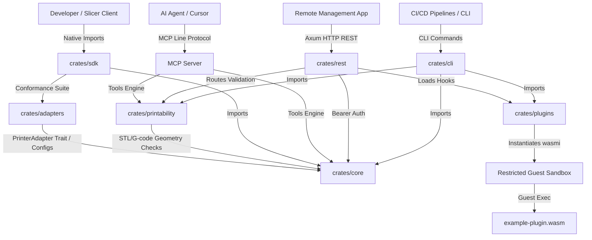
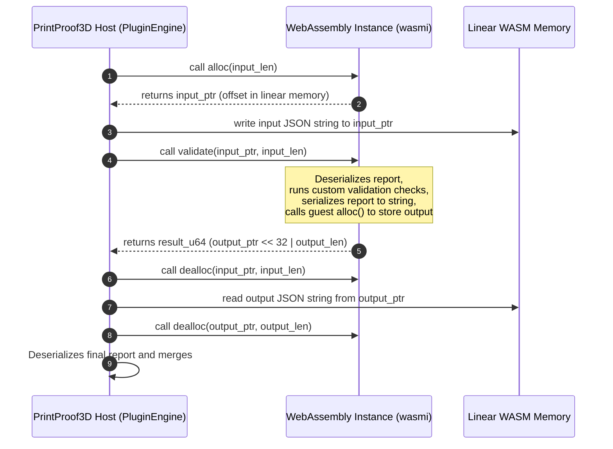

# PrintProof3D User Manual & Integration Guide

Welcome to the **PrintProof3D User Manual**. This document is split into three parts:
- **Part 1 — Core Validation Concepts**: Conceptual model, profiles, validation rules, and report statuses.
- **Part 2 — For Technical Operators (Systems Integration)**: System architecture & crate boundaries, geometry math, G-code travel tracking, WASM memory sandbox protocols, REST API, and MCP configurations.
- **Part 3 — For Developers (Crates & Codebase)**: Local setup, writing custom WASM plugins, implementing connection adapters, and running compliance tests.

---

# Part 1 — Core Validation Concepts

This section covers the core concepts, validation logic, and configuration models behind the PrintProof3D engine.

## 1. What is PrintProof3D?
PrintProof3D is a static file and capability validation engine for 3D printing. In a typical workflow, you download a 3D model, slice it, and send it directly to your printer. If the model has geometry defects or if the slicer settings are misaligned with your hardware, you risk wasting filament, creating failed prints, or running commands that exceed your printer's capability thresholds.

PrintProof3D acts as a pre-flight check. It inspects your 3D models (STL files) and pre-sliced print files (G-code) before they are sent to the printer to verify that they are watertight and match the configured capabilities and temperature envelopes of your specific machine and filament. It does not certify physical printer operation, prevent motion/heating faults, or guarantee physical print safety.

---

## 2. Profile Structures
To validate prints, you must define the target machine and filament using two JSON files: the **Printer Profile** and the **Material Profile**.

### 2.1 The Printer Profile (`.json`)
This file defines the physical dimensions, safety thresholds, and capabilities of your 3D printer:

* **Manufacturer & Model**: Identifies the machine (e.g. "Prusa MK4").
* **Build Volume**: The physical boundaries of the bed.
  * *Rectangular*: Specified as `x` (width), `y` (depth), and `z` (height) in millimeters.
  * *Cylindrical*: Specified as `diameter` and `z` height in millimeters (common for circular beds or delta printers).
* **Bed Shape**: Tells the system the shape of your printbed. This must match the volume (a `circular` bed requires a `cylindrical` volume).
* **Nozzle Diameters**: The nozzle sizes you have available (e.g., `0.4` mm, `0.6` mm). 
* **Max Hotend & Bed Temperatures**: Physical safety cutoffs. If a file attempts to heat the nozzle or bed past these limits, PrintProof3D flags it as a critical hazard.
* **Unsafe Commands**: A list of codes to block. For example, blocking `M500` prevents print files from saving random settings to your printer's permanent memory.

### 2.2 The Material Profile (`.json`)
This file defines the thermal requirements and printing limits of your filament (e.g., PLA, PETG, ABS).
* **Min/Max Nozzle & Bed Temperature**: The recommended operating temperature range specified by the filament manufacturer.
* **Warp Risk**: The likelihood of the plastic curling as it cools. High-warp materials (like ABS) trigger strict warnings if the model's footprint touching the bed is too small.
* **Overhang & Bridge Difficulty**: Mapped to cooling properties to evaluate overhang angles.

### 2.3 The Connection Configuration Profile (`.json`)
This file details network endpoints, serial configurations, and authentication details required to establish remote control channels:

```json
{
  "name": "OctoPrint Studio",
  "mode": "physical",
  "protocol_family": "octoprint",
  "base_url": "http://192.168.1.50",
  "auth_type": "api_key",
  "api_key_env_var": "OCTOPRINT_API_KEY",
  "tls_enabled": false,
  "dispatch_policy": "allow_start"
}
```

* **Target Modes (`mode`)**:
  * `simulator`: Route commands to test and simulator endpoints.
  * `physical`: Route commands to active machine hardware.
* **Authentication Policies (`auth_type`)**:
  * `none`: Unauthenticated access.
  * `api_key`: Relies on environment variable specified in `api_key_env_var`.
  * `password`: Relies on `username` and password environment variable specified in `password_env_var`.
* **Dispatch Policies (`dispatch_policy`)**:
  * `dry_run_only`: Restricts execution.
  * `upload_only`: Restricts actions to file upload; job starting is blocked.
  * `allow_start`: Full control permission.

---

## 3. Reading the Validation Report
After running a check, PrintProof3D outputs a unified validation report. The most important field is the **`status`**, which can return one of three results:

1. **`pass` (Green)**: The file matches all profiles. It passes PrintProof3D profile and file validation checks.
2. **`warning` (Yellow)**: Non-blocking issues were found. You should review them, but they do not trigger validation failures under the active profiles. Common warnings include low bed contact area or steep overhangs.
3. **`fail` (Red)**: Critical errors were detected (such as coordinates that exceed the printer profile's build volume or temperatures that exceed profile limits). Validation fails.

Every warning or failure includes a **Suggested Fix** explaining how to resolve it (e.g., "Add support structures in your slicer").

---

## 4. The CLI Preflight Subcommand
The `preflight` subcommand provides a single, unified print job verification workflow. You can validate a model file (`--model`) or pre-sliced G-code (`--gcode`) against a printer profile (`--printer`) and optional material profile (`--material`).

Additionally, you can run simulator-backed printer connectivity checks using the `--simulator <protocol>` argument (e.g., `--simulator prusalink`, `--simulator rrf`, etc.). This spins up an in-process mock server twin, validates adapter client communication/telemetry retrieval, and embeds the telemetry status in the JSON report under `sliced_settings_assumed.simulator_telemetry`.

---

## 5. Profile Management & Compatibility CLI Commands

PrintProof3D provides utility commands to discover profiles, inspect and validate profile schemas, and verify print compatibility across multi-dimensional criteria (printer profiles, material profiles, STL models, and pre-sliced G-code).

### 5.1 Profile Discovery
* **`list-printers`**: Discovers and lists all validated printer profiles in a target directory.
  * *Arguments/Flags*:
    * `-d, --directory <PATH>`: Directory path (defaults to `profiles/`).
    * `-f, --format <text|json>`: Output format (defaults to `text`).
  * *Examples*:
    ```bash
    # Print human-readable list of printer profiles
    target/release/printproof3d.exe list-printers --directory profiles/ --format text

    # Print JSON output of discovered printers (sorted alphabetically by manufacturer/model)
    target/release/printproof3d.exe list-printers --format json
    ```
* **`list-materials`**: Discovers and lists all validated material profiles in a target directory.
  * *Arguments/Flags*:
    * `-d, --directory <PATH>`: Directory path (defaults to `profiles/`).
    * `-f, --format <text|json>`: Output format (defaults to `text`).
  * *Examples*:
    ```bash
    # Print human-readable list of material profiles
    target/release/printproof3d.exe list-materials --directory profiles/ --format text

    # Print JSON output of discovered materials (sorted alphabetically by name)
    target/release/printproof3d.exe list-materials --format json
    ```

### 5.2 Profile Inspection
* **`inspect-profile <FILE>`**: Decodes and auto-detects whether the given file is a printer profile or a material profile, printing a complete list of its structural fields.
  * *Arguments/Flags*:
    * `<FILE>`: Path to target profile JSON.
    * `-f, --format <text|json>`: Output format (defaults to `text`).
    * `-o, --output <FILE>`: Optional path to write the output report.
  * *Examples*:
    ```bash
    # Human-readable printer profile inspection details
    target/release/printproof3d.exe inspect-profile profiles/prusa_mk4.json
    # JSON-formatted material profile inspection
    target/release/printproof3d.exe inspect-profile profiles/pla.json --format json
    ```
  * *Output Redirection*: All profile inspection tasks support saving validation structures directly to a file via the `-o, --output <FILE>` argument.

### 5.3 Profile Validation
* **`validate-printer-profile <FILE>`**: Validates printer profile JSON structure and runs safety boundaries checks (e.g. bed shape volume alignment, maximum nozzle/bed temps). Exits with `0` if valid, `1` if invalid.
  * *Arguments/Flags*:
    * `-f, --format <text|json>`: Output format (defaults to `text`).
    * `-o, --output <FILE>`: Optional path to write the output report.
  * *Examples*:
    ```bash
    # Text validation confirmation
    target/release/printproof3d.exe validate-printer-profile profiles/prusa_mk4.json
    ```
* **`validate-material-profile <FILE>`**: Validates material profile JSON structure and runs bounds checks (e.g. extrusion and fan speed parameters). Exits with `0` if valid, `1` if invalid.
  * *Arguments/Flags*:
    * `-f, --format <text|json>`: Output format (defaults to `text`).
    * `-o, --output <FILE>`: Optional path to write the output report.
  * *Examples*:
    ```bash
    # JSON-formatted validation confirmation
    target/release/printproof3d.exe validate-material-profile profiles/pla.json --format json
    ```

### 5.4 Directory Validation
* **`validate-profile-directory <DIRECTORY>`**: Validates all JSON files inside a target directory, checking if they are printer or material profiles and validating their schemas. Exits with `0` if all files are valid; exits with `1` if any file is invalid or cannot be parsed.
  * *Arguments/Flags*:
    * `-f, --format <text|json>`: Output format (defaults to `text`).
    * `-o, --output <FILE>`: Optional path to write the directory validation summary.
  * *Examples*:
    ```bash
    # Validate entire profiles folder in text format
    target/release/printproof3d.exe validate-profile-directory profiles/ --format text
    ```

### 5.5 Template Profile Generation
* **`generate-printer-profile`**: Generates a default, conformant printer profile template JSON payload. This command always emits JSON and does not accept the `--format` option.
  * *Arguments/Flags*:
    * `-o, --output <FILE>`: Optional path to write the template file. If omitted, templates are printed to standard output.
  * *Examples*:
    ```bash
    # Generate and save template to custom location
    target/release/printproof3d.exe generate-printer-profile --output my_custom_printer.json
    ```
* **`generate-material-profile`**: Generates a default, conformant material profile template JSON payload. This command always emits JSON and does not accept the `--format` option.
  * *Arguments/Flags*:
    * `-o, --output <FILE>`: Optional path to write the template file. If omitted, templates are printed to standard output.
  * *Examples*:
    ```bash
    # Generate and save template to custom location
    target/release/printproof3d.exe generate-material-profile --output my_custom_material.json
    ```

### 5.6 Compatibility Verification
* **`check-compatibility`**: Runs multi-dimensional audits to verify alignment between machine specifications, material limits, and geometric assets.
  * *Flags*:
    * `-p, --printer <PRINTER_FILE>`: (Required) Target printer profile.
    * `-a, --material <MATERIAL_FILE>`: (Optional) Material profile to verify.
    * `-m, --model <MODEL_FILE>`: (Optional) STL geometry to verify.
    * `-g, --gcode <GCODE_FILE>`: (Optional) Pre-sliced G-code to verify.
    * `-f, --format <text|json>`: Output format (defaults to `text`).
    * `-o, --output <FILE>`: Optional path to write the compatibility report.
  * *Rules Evaluated*:
    * **Nozzle Temperature**: material thermal envelope vs printer physical capabilities.
    * **Bed Temperature**: material bed temperature vs printer bed capability.
    * **Enclosure**: enclosure requirements matching printer configuration.
    * **Nozzle Feature Size**: min feature size compatibility with installed/default nozzle sizes.
    * **Build Volume Bounds**: model bounding box dimensions fitting within the rectangular/cylindrical printer envelope.
    * **G-code Motion & Thermals**: coordinates and thermal instructions within printer/material boundaries.
  * *Examples*:
    ```bash
    # Verify printer + material profile compatibility
    target/release/printproof3d.exe check-compatibility --printer profiles/prusa_mk4.json --material profiles/pla.json

    # Verify printer + model volume footprint compatibility and write output to file
    target/release/printproof3d.exe check-compatibility --printer profiles/prusa_mk4.json --model fixtures/tetrahedron.stl --output comp_report.txt

    # Verify printer + sliced G-code compatibility
    target/release/printproof3d.exe check-compatibility --printer profiles/prusa_mk4.json --gcode fixtures/safe_print.gcode
    ```

# Part 2 — For Technical Operators

## 1. System Architecture & Crate Boundaries

PrintProof3D is structured as a Cargo workspace containing decoupled, specialized crates. Below is the structural topology detailing how Native, CLI, REST API, and AI MCP channels route validation requests:



### 1.1 WebAssembly Memory Sandbox Flow
Custom validation rules are executed inside a sandboxed `wasmi` memory boundary. Because WASM linear memory is isolated, reports are serialized and copied over shared memory blocks:



---

## 2. Under the Hood: Mathematical Validation

### 2.1 STL Geometry Auditing
The engine parses STL files and performs geometric verification using the following logic:

* **Vertex Quantization**: To prevent floating-point rounding errors (where adjacent faces don't align due to minor float variances), coordinates are scaled to micrometers and rounded to 3D integer keys:
  $$K_v = \left[ \text{round}(x \times 1000), \text{round}(y \times 1000), \text{round}(z \times 1000) \right]$$
* **Manifold (Watertight) Verifier**: The engine identifies edges by sorting vertex coordinates canonically. In a closed manifold shell, every edge must be shared by **exactly two** triangles. If an edge is shared by only **1 triangle** (a hole) or **3+ triangles** (self-intersection), it flags a `MESH_NOT_MANIFOLD` critical failure.
* **Cylindrical Delta Bed Check**: For circular beds, Cartesian coordinates are converted to a radial distance $R$ from the bed center:
  $$R^2 = x^2 + y^2$$
  If $R^2 > (diameter / 2)^2$ for any vertex, it triggers a `MODEL_OUT_OF_BOUNDS` error.
* **Overhang Slope Tilt Analysis**: The engine checks the angle $\theta$ between the downward normal vector and each triangle face normal $\hat{n} = [n_x, n_y, n_z]$:
  $$\cos\theta = \frac{-\hat{n}_z}{\|\hat{n}\|}$$
  If $\cos\theta < \cos\theta_{limit}$ (where $\theta_{limit}$ is $45^\circ$, $50^\circ$, or $55^\circ$ depending on the material's cooling properties), the overhang is too steep and requires support structures.
* **Bed Adhesion Footprint Ratio**: contact area is calculated using vector cross-products of facets touching the bed surface ($Z < 0.05$ mm):
  $$\text{Area} = \frac{1}{2} \|(V_1 - V_0) \times (V_2 - V_0)\|$$
  If the contact area is $< 5\%$ of the model's 2D bounding footprint area, it flags a `POOR_BED_ADHESION` warning.

### 2.2 G-Code Toolpath Analysis
* **Stateful Coordinates Tracking**: Tracks the toolhead's current $X$, $Y$, and $Z$ positions. It monitors absolute positioning (`G90`), relative positioning (`G91`), homing commands (`G28`), and movement segments (`G0`–`G3`). If any movement places the toolhead outside the build volume, the engine flags a `GCODE_OUT_OF_BOUNDS` error.
* **Thermal Target Monitoring**: Intercepts hotend commands (`M104`/`M109`) and bed commands (`M140`/`M190`). Targets exceeding printer limits flag `Critical` errors, while targets outside material temp windows flag `Major` errors.

---

## 3. Systems Integration & Remote APIs

### 3.1 Axum REST Web Service
Start the REST validation microservice:
```bash
cargo run --package printproof3d-rest
```
* Binds to: `127.0.0.1:3000`
* Security: Enforces Bearer token headers (`Authorization: Bearer secret_print_token`). You can override the token by setting the `PRINTPROOF3D_API_TOKEN` environment variable.

#### Endpoints:
* `GET /profiles/printers` — Lists all valid printer JSON profiles.
* `GET /profiles/materials` — Lists all valid material JSON profiles.
* `POST /profiles/inspect` — Automatically detects profile category (printer or material) and returns metadata.
* `POST /profiles/validate/printer` — Validates a printer JSON profile against safety boundaries.
* `POST /profiles/validate/material` — Validates a material JSON profile against safety boundaries.
* `POST /validate/model` (Multipart) — Performs static STL mesh geometry audit. Accepts `model` (STL file), `printer` (JSON profile), and `material` (JSON profile).
* `POST /validate/gcode` (Multipart) — Performs stateful G-code toolpath audit. Accepts `gcode` (file), `printer` (JSON profile), and optional `material` (JSON profile).
* `POST /validate/compatibility` (Multipart) — Performs multi-dimensional alignment audits. Accepts optional `printer`, `material`, `model`, and `gcode` fields.

### 3.2 Model Context Protocol (MCP) Server
Integrate validation directly into AI agents (like Claude Desktop or Cursor) over standard I/O:
```bash
printproof3d mcp
```
* **Exposed Tools**: `validate_model_printability`, `validate_gcode`, `list_printer_profiles`, and `explain_validation_report`.
* **Claude Desktop Integration**: Add this configuration to your `%APPDATA%\Claude\claude_desktop_config.json`:
  ```json
  {
    "mcpServers": {
      "printproof3d": {
        "command": "C:\\path\\to\\printproof3d.exe",
        "args": ["mcp"]
      }
    }
  }
  ```

---

# Part 3 — For Developers

This section details how to compile, test, write WASM plugins, and contribute to the PrintProof3D codebase.

## 1. Local Setup & Compilation

### Prerequisites
* Rust toolchain (edition 2021).
* WebAssembly target: `rustup target add wasm32-unknown-unknown`.

### Setup Steps
```bash
# Clone the repository
git clone https://github.com/scottconverse/PrintProof3D.git
cd PrintProof3D

# Compile the native targets and validation tests
cargo test --workspace

# Compile the example WASM rules plugin
cargo build --package example-plugin --target wasm32-unknown-unknown --release
```

---

## 2. Writing a Custom WASM Validation Plugin

PrintProof3D supports extending validation using WebAssembly plugins. Plugins are executed inside a sandboxed `wasmi` memory boundary.

### 2.1 The Memory Sharing Protocol
Because WASM runs in an isolated sandbox, data is exchanged by passing pointers to linear memory:
1. The host calls `alloc` on the guest WASM to reserve a memory block.
2. The host writes the serialized `ValidationReport` JSON string into the block.
3. The host executes the guest's `validate(ptr, len)` function.
4. The guest processes the validation, updates the report, allocates an output buffer, writes the result, and returns a packed 64-bit value containing the output pointer and length:
   $$\text{result\_u64} = (\text{output\_ptr} \ll 32) \mid \text{output\_len}$$
5. The host reads the updated JSON string and frees memory using the guest's `dealloc` function.

### 2.2 Step-by-Step Plugin Implementation
1. **Initialize the Crate**:
   Create a standard Rust library:
   ```bash
   cargo new --lib my-plugin
   cd my-plugin
   ```
2. **Configure Cargo.toml**:
   Set `crate-type = ["cdylib"]`:
   ```toml
   [lib]
   crate-type = ["cdylib"]

   [dependencies]
   printproof3d-core = { path = "../PrintProof3D/crates/core" }
   printproof3d-plugins = { path = "../PrintProof3D/crates/plugins" }
   serde = { version = "1.0", features = ["derive"] }
   serde_json = "1.0"
   ```
3. **Write the Rule logic (`src/lib.rs`)**:
   Implement a function targeting `ValidationReport` and export it using the `export_validation_plugin!` macro:
   ```rust
   use printproof3d_plugins::{
       export_validation_plugin, ValidationReport, ValidationIssue, IssueSeverity, ValidationStatus
   };

   fn enforce_safety_margin(report: &mut ValidationReport) {
       // Ensure that model bounding box does not exceed a safety limit
       if report.model.bounding_box.max_x > 200.0 {
           report.issues.push(ValidationIssue {
               id: "SAFETY_MARGIN_EXCEEDED".to_string(),
               severity: IssueSeverity::Major,
               message: "Model exceeds 200mm safety margin on the X axis.".to_string(),
               location: None,
               suggested_fixes: vec!["Center or scale down the model.".to_string()],
           });
           report.status = ValidationStatus::Fail;
       }
   }

   export_validation_plugin!(enforce_safety_margin);
   ```
4. **Compile to WebAssembly**:
   ```bash
   cargo build --target wasm32-unknown-unknown --release
   ```
5. **Run the Plugin**:
   Invoke using the locally compiled binary or a globally installed CLI:
   ```bash
   # Local path (Windows example)
   target\debug\printproof3d.exe validate-model --model fixtures/tetrahedron.stl --printer profiles/prusa_mk4.json --material profiles/pla.json --plugin target/wasm32-unknown-unknown/release/my_plugin.wasm

   # Local path (Unix example)
   ./target/debug/printproof3d validate-model --model fixtures/tetrahedron.stl --printer profiles/prusa_mk4.json --material profiles/pla.json --plugin target/wasm32-unknown-unknown/release/my_plugin.wasm

   # Globally installed CLI
   printproof3d validate-model --model fixtures/tetrahedron.stl --printer profiles/prusa_mk4.json --material profiles/pla.json --plugin target/wasm32-unknown-unknown/release/my_plugin.wasm
   ```

---

## 3. Custom Printer Connections & Compliance Tests

If you are developing a custom connection adapter (e.g. supporting a new network protocol or firmware interface), you can verify its compliance using the conformance test suite.

1. Implement the `PrinterAdapter` trait on your connection client (from `printproof3d-adapters`).
2. Run the automated compliance suite `run_conformance_tests` in a test block:
   ```rust
   use printproof3d_adapters::PrinterAdapter;
   use printproof3d_sdk::run_conformance_tests;

   #[tokio::test]
   async fn test_my_custom_client() {
       let mut client = MyOctoPrintClient::new("192.168.1.100");
       let result = run_conformance_tests(&mut client).await;
       assert!(result.is_ok(), "Conformance failed: {:?}", result);
   }
   ```
The test suite runs a linear happy-path execution sequence, checking that basic connection handshakes, telemetry polling, pauses, resumes, and cancellation actions execute reliably and return standard `AdapterError` responses under standard operation.

### 3.1 Registry Integration Flow
To make your custom adapter reachable by the system:
1. Add the protocol name to the `ProtocolFamily` enum in `crates/core/src/lib.rs`.
2. Update `PrinterConnectionConfig::validate()` in `crates/core/src/connection.rs` to configure any protocol-specific validation checks.
3. Import your adapter and add its instantiation branch to the pattern match block in `PrinterAdapterFactory::build()` inside `crates/adapters/src/factory.rs`.
4. Run the conformance tests in a unit test to confirm integration.
